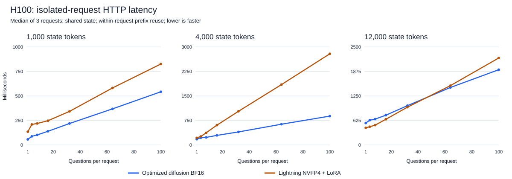

# Nemotron diffusion decision-serving optimization

H100 in-process and final-container HTTP measurements completed. Container
publication is in progress. Tables distinguish HTTP from in-process measurements.

## Decision

The serving optimization is promising for latency, but it does not fix this
checkpoint's long-input accuracy. For the tested quality-sensitive, long-context
decision batches, Lightning + LoRA is the stronger choice. For short-context
decisions where latency dominates, the optimized diffusion scorer merits an
application-specific evaluation. This is a comparison of these checkpoints and
serving configurations, not proof that one model family is inherently better.

The matched 100-question HTTP comparison favors diffusion latency by about
**1.5×, 3.2×, and 1.2×** at 1k, 4k, and 12k state lengths. At the same lengths,
Lightning + LoRA scores **99%, 99–100%, and 100%**, versus diffusion's
**91%, 83%, and 33%**. The long-context quality difference outweighs the small
12k latency advantage for workloads that require correct decisions.

## What was built

- [vLLM implementation](https://github.com/pst2154/vllm/tree/feat/nemotron-labs-diffusion),
  commit `2c83d10caa71e3a9eac8fdd9f1288dac8c65596b`, based on upstream
  `42a85a49761921fe5965e28eb971d863d9759503`.
- An optimized application branch based on `feat/nemotron-decision-lab`, retaining
  the explorer and `/v1/systemone` Choice, Noul, and Score responses.
- A source-built vLLM container and an API/UI container, rather than relying on
  a pre-existing patched runtime.

This is **Nemotron-Labs-Diffusion-14B**, not DiffusionGemma and not Lightning.
The pinned diffusion checkpoint revision is
`f8c3e2c078e193599b8882d965b1001c456ba738`.

Each question retains its original prompt and ends with one real mask token.
vLLM evaluates candidate scores at that position. Its internal sampled token is
discarded; there is no autoregressive answer rollout, chat endpoint, or multi-token
diffusion generation. Questions are independent sequences, not jointly decoded
answer slots.

The optimization combines question batching, shared-prefix caching and priming,
candidate-only vocabulary projection, direct logits, CUDA graphs, cached code
token mappings, and batched prompt tokenization. The weights were not fine-tuned
or quantized for this diffusion experiment. The candidate-only head retains the
original vocabulary weights in memory; it reduces projection work, not checkpoint
size.

## Hardware and comparison method

All model measurements used the same H100 80 GB, with one experiment using the
GPU at a time. Diffusion uses BF16 weights; Lightning uses NVFP4, with and without
the existing rank-16 adapter. These precision and model-size differences matter.
The final diffusion runtime contains vLLM `0.1.dev2+g2c83d10ca`, PyTorch
`2.13.0+cu130`, Transformers `5.17.0`, and FlashInfer `0.6.18.post1`.

The frozen regression suite has 72 cases: 24 Choice, 24 Noul, and 24 Score.
The scaling fixture supplies 100 item/color facts plus irrelevant padding and
asks subsets of those questions. State lengths are exactly 1,000, 4,000, and
12,000 tokens under both tokenizers. Question counts are 1, 4, 8, 16, 32, 64, and
100, with three repetitions. Each full matrix contains 135 requests and 2,097
scored decisions; repetitions and overlapping subsets are **not independent
accuracy examples**.
These are single-client requests containing multiple questions, not a
multi-client concurrency or saturation benchmark.

Models receive identical API payloads, verified by payload hashes. Their full
serving prompts differ according to their adapters; equal state length does not
mean equal total prompt length. Labels are deterministic, not supplied by an LLM
judge. These fixtures are limited and do not establish general production quality.

## Latency: 100 questions

Milliseconds per request, including prompt preparation. Native, cold-prefix,
and warm-prefix diffusion rows are in-process. Rows labeled HTTP include their
respective gateways.

| Configuration | 1k state | 4k state | 12k state |
| --- | ---: | ---: | ---: |
| Native diffusion, sequential, median | 8,405.8 | 25,355.4 | 75,773.7 |
| Optimized diffusion, cold prefix | 534.9 | 855.4 | 1,990.9 |
| Optimized diffusion, warm prefix range | 141.1–157.9 | 414.1–414.3 | 1,102.5–1,116.3 |
| Optimized diffusion, isolated-request HTTP median | 542.1 | 881.4 | 1,918.0 |
| Lightning NVFP4 base, HTTP median | 711.2 | 2,468.1 | 2,188.8 |
| Lightning NVFP4 + LoRA, HTTP median | 825.5 | 2,788.8 | 2,217.7 |

Cold diffusion resets its prefix cache before the question-count group; the next
two repeats reuse it. Lightning isolates the prefix cache between HTTP requests
while retaining within-request sharing. **Do not compare warm diffusion directly
with isolated-request Lightning as if cache conditions were equal.** The
isolated-request HTTP row is the matched-cache-policy comparison. Its final
container completed all 135 requests and retained the accuracy counts below.

The native scorer never reuses a prefix cache across questions or requests. Its
original raw file labels repeats as `warm`, meaning only repeated invocation;
the benchmark has since corrected that label to `disabled` without rewriting
the original measurements.

## Accuracy

| Configuration | Frozen cases | 100 questions, 1k | 100 questions, 4k | 100 questions, 12k |
| --- | ---: | ---: | ---: | ---: |
| Native diffusion | 72/72 | 89/100 | 83/100 | 33/100 |
| Optimized diffusion with graphs | 72/72 | 91/100 | 83/100 | 33/100 |
| Lightning NVFP4 base | 70/72 | 95–98/100 | 89–90/100 | 94–95/100 |
| Lightning NVFP4 + LoRA | 72/72 | 99/100 | 99–100/100 | 100/100 |

Ranges show the three repeats. Lightning's configured stochastic rounding permits
repeat variation. Diffusion's reported counts were unchanged across the three
repeats for each configuration. Faster execution has not solved diffusion's
retrieval failures under long padded inputs.

## Numerical parity: a limitation, not a passed gate

Optimized graph execution agrees with native on **2,079/2,097 decisions (99.14%)**.
The maximum candidate-probability difference is **0.087742**. The strict checker
requires all choices to agree and probability drift no greater than 0.02, so
**strict parity fails**. We did not relax that checker or omit failing questions.

The initial eager vLLM run changed several near-tied answers. Running vLLM with
one sequence and no prefix cache retained those choices, ruling out question
batching/cache reuse as the explanation for those changes. A separate native
single-pass versus cached-mask diagnostic retained the native choices on the
three inspected borderline questions. The remaining difference is between the
native and vLLM numerical execution paths; it is not established as one specific
kernel bug. Do not assume scores or threshold decisions are identical between
backends. The 72 frozen-case outcomes alone do not prove numerical equivalence.

## CPU work matters

For 100 questions, an isolated tokenization test reduced preparation from about
636 ms to 177 ms at 4k input, and 2,339 ms to 561 ms at 12k. It checked exact
prepared-question and token-ID equality for every tested input. The serving
container uses one Torch CPU thread and eight tokenizer workers; match the
tokenizer worker count to available CPUs.

## Supported scope and validation

The pinned tokenizer supplies 62 single-token answer codes. Requests support up
to 512 independent questions, but at most 62 options per question. The scheduler's
128 active-sequence limit is not a 128-question request limit. Cross-request
continuous batching is not implemented: requests share one inference lock.
Confidence is maximum candidate probability, not an empirically calibrated
statistic or TypeSafe's proprietary confidence implementation.

All 17 CPU tests and the live API suite passed. The live suite checks all three
answer types, normalization, score arithmetic, contrasting states, 16-question
semantic answers, the 129-question response contract, all 62 choices, and
rejection of 513 questions, 63 choices, and an oversized body. Health and explorer
routes respond successfully; the chat-generation route returns 404. This does
not turn the separately failed numerical-parity check into a pass.

## Reproducibility

Raw measurements are in `evaluation/optimized-results/`. The main files are
`native-full.jsonl`, `lightning-base-http.jsonl`, `lightning-http.jsonl`,
`vllm-eager-initial.jsonl`, `vllm-eager-serial.jsonl`,
`vllm-optimized-eager.jsonl`, `vllm-optimized-graphs.jsonl`, and
`vllm-http-isolated.jsonl`.
`native-forward-diagnostic.json` and `tokenization-batch.json` preserve the
targeted diagnostics. `compare_backends.py` produces measurements and
`compare_results.py` detects missing requests, answer changes, and probability
drift. Public results omit endpoint addresses, personal paths, and credentials.
