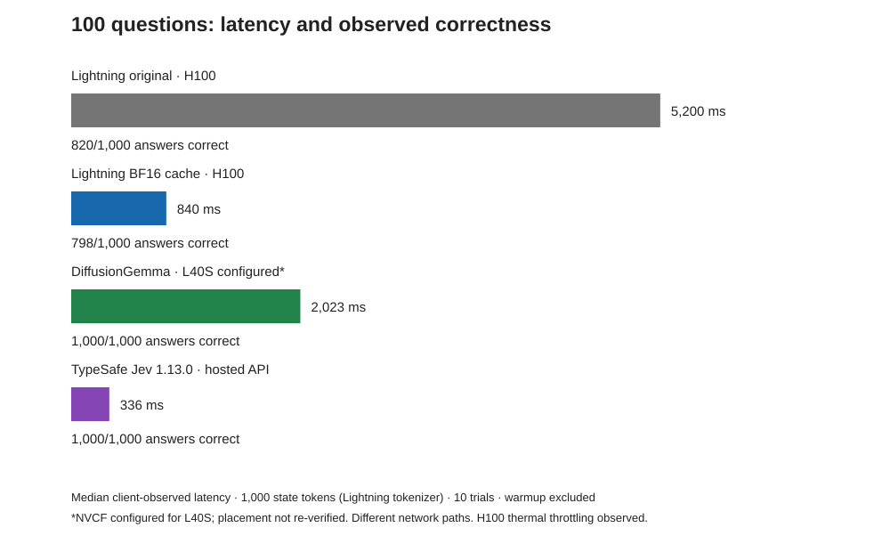
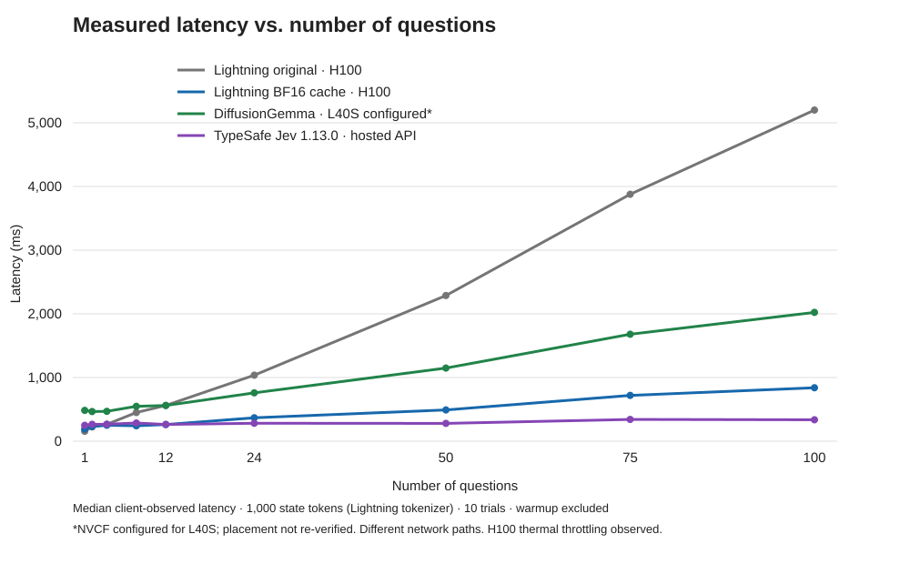

# Experiment 3: fast NVFP4 Lightning + trained LoRA

Measured September 21, 2026. **Direct LoRA on the original NVFP4 checkpoint
works: 837.22 ms median and 1,000/1,000 correct at 100 questions.** No new
quantization was necessary. This is the original short-prompt System One
adapter, not the later shared-schema/native scoring experiment.

## Speed chart

For the original comparison, see the [original 100-question speed chart](../lightning-systemone/hundred-questions.svg).



### Original latency line graph



This line graph shows the original experiment's measured scaling, before the
fine-tune. The combination has been measured at 1 and 100 questions only.

The combination preserves approximately the same measured latency: **839.53 ms
originally versus 837.22 ms with the fine-tune**, while lookup correctness rose
from **798/1,000 to 1,000/1,000**. These are separate runs on different H100
variants, not a claim of identical performance; the same-server control below
is the tighter comparison. The original chart remains historical evidence,
not a chart of the fine-tuned model.

| Configuration | 100-question HTTP median | HTTP p95 | Correct |
| --- | ---: | ---: | ---: |
| Historical original fast run | 839.53 ms | 961.04 ms | 798/1,000 |
| Fresh NVFP4 base, adapter off | 778.66 ms | 804.20 ms | 803/1,000 |
| Same server, trained LoRA on | **837.22 ms** | **935.32 ms** | **1,000/1,000** |

Against the fresh control, the fine-tune improved lookup accuracy by 19.7
percentage points with approximately 7.5% higher median latency. All ten
measured 100-question calls completed for both configurations. One warm-up per
configuration/count was excluded. With ten trials, nearest-rank p95 is the max.
The one-question measurements were 190.06 ms base and 214.98 ms trained, both
10/10 correct; that smaller test asks only the first fixture question.

## What stayed fixed

- Original saved 1,000-token state fixture, original per-question prompt,
  original `adapter.py`, and original `compare_endpoints.py`, byte-for-byte.
- One outer System One request, 100 upstream workers, state-first prompts,
  persistent upstream HTTP, no explicit prefix priming, unique cache salts
  between outer requests.
- vLLM `0.29.1rc1.dev397+ga8d1aa9c9`, original NVFP4 weights, Marlin MoE,
  FlashInfer Mamba, BF16 attention KV, FP16 Mamba state with stochastic
  rounding/five Philox rounds, prefix caching, asynchronous scheduling.
- Context and scheduled-token budgets 16,384; max sequences 128; GPU memory
  utilization 0.85; temperature zero, one constrained output token/question,
  top-20 logprobs. No Nimble full-schema prompt was substituted.
- Same remote client over an SSH tunnel for both new runs, including API,
  adapter prompt construction, upstream requests, and network latency.

## What changed

The new test runs on one H100 80GB, rather than the historical device reporting
about 96 GiB. Both fresh controls use the same LoRA-enabled engine. The trained
request selects the saved rank-16 adapter; the baseline selects the base model.
LoRA is added dynamically to the existing NVFP4 weights; this is **not** a new
FP4 export of the merged BF16 checkpoint. The adapter was trained against the
BF16 checkpoint, and the original NVFP4 artifact has its own quantization
history. This test validates their combination rather than claiming byte-level
equivalence to merged BF16 followed by quantization.

The only new serving options beyond the original recipe are:

```text
--enable-lora --max-lora-rank 16 --lora-modules trained=ADAPTER_PATH
```

Set the existing adapter's `UPSTREAM_MODEL` to the registered LoRA name for
trained calls, or to the base served-model name for controls. Keep the original
adapter environment settings above. No original checkpoint, trained adapter,
or merged checkpoint was overwritten. Only the separate experiment service was
changed; no existing production deployment was modified.

The model registry identified the loaded adapter as a child of the original
Lightning model. Prefix-cache hits totaled 2,334,816 tokens across 22 warm/measured
100-question calls: exactly `1,072 * 99 * 22`. GPU spot check: 62 C, 1,980 MHz.
All ten original adapter unit tests passed.

## Scope and evidence

This is the original alternating on/off **lookup benchmark**, not 1,000
independent semantic questions and not the 324-item Nimble holdout. It does not
establish perfect general accuracy. Base then trained were tested successively,
not randomized paired trials; stochastic rounding can change borderline answers.

Source SHA-256 checks:

- `adapter.py`: `1b5745bc21a88b6ae4ef1c4431674d693087ed91f9b4d68d804a682463bdc1d6`
- `comparison-inputs.json`: `64da9e7a96f4820be7a0f452d4116229d2b840aa13d42543cdef0df06e0775a9`
- `compare_endpoints.py`: `bec8bacfad899382865116e1b239ba1d3ec2c43e567e9a9cec4ee85c8137fa46`

Raw results: `comparison-nvfp4-base-lora-engine.json` and
`comparison-nvfp4-trained-lora.json`. Every returned per-question probability
and choice is retained in those files. Original fixture and runner remain in
the earlier Lightning System One experiment.

A subsequent validation of the isolated runner completed another ten requests
per count: 1,000/1,000 at 100 questions, with 801.73 ms median. It is retained in
[verification-runner.json](verification-runner.json), not substituted for the
first 837.22 ms result or pooled into its statistics.

Adapter SHA-256: `fb862c8f2600a3e9ade87fe7139de94d837ca4474657b9159f3b8260f81de075`.
Adapter configuration SHA-256: `db20ccc562beacc1544b48b5151573ff0bbd149ef811054b575ecfc59c8a238c`.

## Selected combination recipe

Use [launch_combination.sh](launch_combination.sh) with your existing
`MODEL_DIR`, `ADAPTER_DIR`, isolated `RUN_DIR`, and allocated `GPU_UUID` set.
It starts a separate loopback-only vLLM server and does not reserve a GPU or
stop another container. The script preserves the tested serving flags; host
paths, container name, and loopback port are configurable. Model weights and
adapter weights are not distributed in this repository.

After the server is healthy, run the unchanged original adapter:

```bash
export UPSTREAM_BASE_URL=http://127.0.0.1:8300/v1
export UPSTREAM_MODEL=trained
export UPSTREAM_CONCURRENCY=100 STATE_FIRST=1 PERSISTENT_UPSTREAM=1
export PRIME_SHARED_PREFIX=0 ISOLATE_REQUEST_CACHE=1
python3 ../lightning-systemone/adapter.py
```

For the base control, set `UPSTREAM_MODEL=lightning`. Select a free `PORT` for
each adapter instance. To run the original saved workload:

```bash
python3 run_benchmark.py --backend trained --url "$SYSTEMONE_TEST_URL" \
  --output "$FRESH_RESULTS_FILE"
```

Choose a fresh output file. The wrapper rejects existing results and isolates
the original runner's writes from Experiment 1. Use `--backend base` when calling
the adapter configured for the base model; the label does not switch models.
This recipe keeps the original short prompts; do not substitute the native
Nimble-schema runner when testing this combination.
